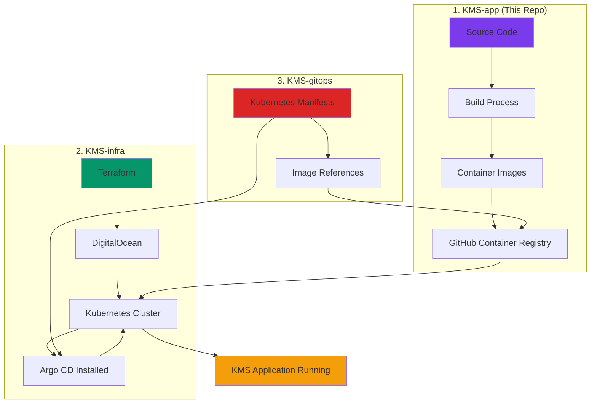
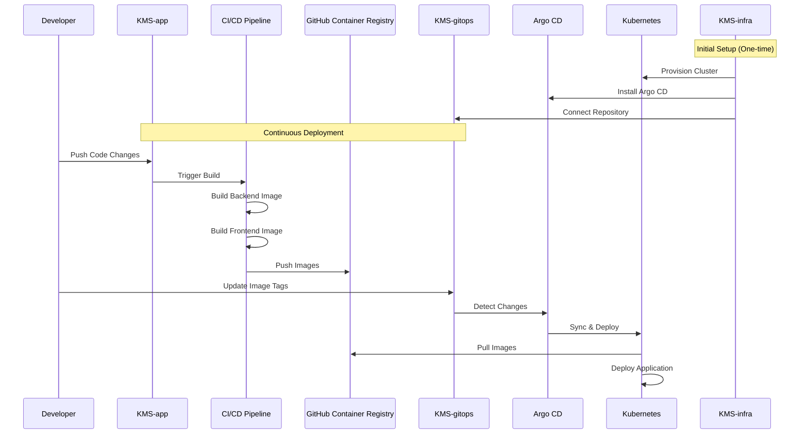
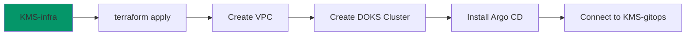
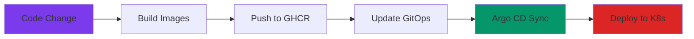
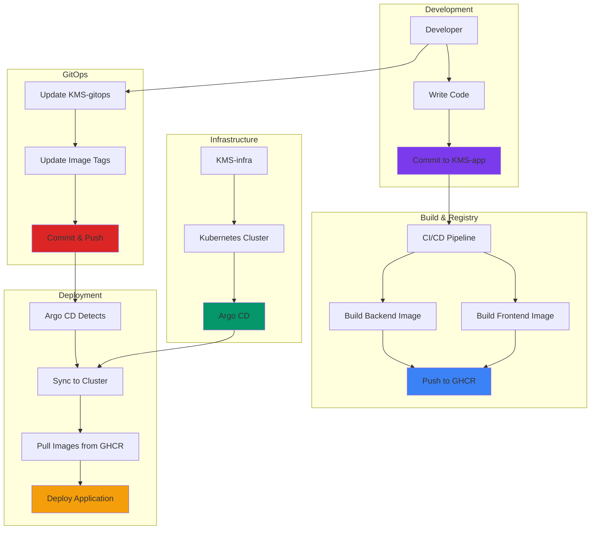

# 🍽️ KMS Application Repository

> **Source code for the Kitchen Management System (KMS) - Backend API, Frontend, and API Specifications**

This repository contains the complete application source code for the Kitchen Management System. It includes the backend REST API, frontend web application, and OpenAPI specifications. This code is built into container images and deployed to Kubernetes via the GitOps workflow.

---

## 📋 Table of Contents

- [Overview](#-overview)
- [What is KMS?](#-what-is-kms)
- [Repository Structure](#-repository-structure)
- [Application Components](#-application-components)
- [How the Three Repositories Work Together](#-how-the-three-repositories-work-together)
- [Complete Deployment Workflow](#-complete-deployment-workflow)
- [Development Setup](#-development-setup)
- [Building Container Images](#-building-container-images)
- [CI/CD Integration](#-cicd-integration)
- [Troubleshooting](#-troubleshooting)

---

## 🎯 Overview

**KMS-app** is the application source code repository that contains:

- ✅ **Backend API** - Node.js/Express REST API with MongoDB
- ✅ **Frontend** - Angular web application
- ✅ **API Specifications** - OpenAPI/Swagger definitions
- ✅ **Dockerfiles** - Container image definitions
- ✅ **Database Schema** - MongoDB schema documentation

This repository is the **source of truth** for application code. Changes here trigger the deployment pipeline that ultimately updates the running application in Kubernetes.

---

## 🍽️ What is KMS?

The **Kitchen Management System (KMS)** is a comprehensive platform for managing kitchen operations:

### Core Features

- 👥 **Staff Management**
  - User roles and permissions (admin, chef, user)
  - Attendance tracking
  - Profile management

- 🍲 **Meal Planning**
  - Menu creation and management
  - Meal scheduling
  - Dietary preferences and allergen tracking
  - Nutritional information

- 📦 **Inventory Management**
  - Ingredient tracking
  - Batch-based inventory
  - Stock level monitoring
  - Supplier management

- 💰 **Financial Operations**
  - Pricing management
  - Payment processing (Stripe integration)
  - Cost tracking
  - Revenue analytics

- 📊 **Analytics & Reporting**
  - Meal consumption analytics
  - Inventory usage reports
  - Staff performance metrics
  - Financial dashboards

---

## 📁 Repository Structure

```
KMS-app/
├── kitchen-planner-be-main/        # Backend API
│   ├── src/                        # Source code
│   │   ├── controllers/            # API controllers
│   │   ├── models/                 # MongoDB models
│   │   ├── router/                 # Express routes
│   │   ├── middleware/             # Auth, logging, etc.
│   │   ├── utils/                  # Utility functions
│   │   └── config/                 # Configuration
│   ├── Dockerfile                  # Backend container image
│   ├── package.json                # Node.js dependencies
│   ├── swagger.js                  # Swagger/OpenAPI generation
│   └── NORMALIZED_SCHEMA_DOCUMENTATION.md
│
├── kitchen-planner-fe-main/        # Frontend Application
│   ├── src/                        # Angular source code
│   │   ├── app/                    # Angular components, services
│   │   ├── assets/                 # Images, static files
│   │   └── environments/           # Environment configs
│   ├── Dockerfile                  # Frontend container image
│   ├── nginx.conf                  # Nginx configuration
│   ├── package.json                # Angular dependencies
│   ├── angular.json                # Angular configuration
│   └── cypress/                    # E2E tests
│
└── kitchen-planner-api-spec-main/  # API Specifications
    └── api-kms-planner.yaml         # OpenAPI specification
```

---

## 🧩 Application Components

### 1. **Backend API** (`kitchen-planner-be-main/`)

**Technology Stack:**
- **Runtime**: Node.js 18
- **Framework**: Express.js
- **Database**: MongoDB (via Mongoose)
- **Authentication**: JWT (JSON Web Tokens)
- **File Storage**: Cloudinary
- **Payments**: Stripe
- **Email**: Nodemailer
- **Real-time**: Socket.io
- **Documentation**: Swagger/OpenAPI

**Key Features:**
- RESTful API endpoints
- Role-based access control (RBAC)
- JWT authentication
- File upload handling
- Payment processing
- Email notifications
- Real-time updates via WebSockets
- Comprehensive logging

**Port**: 8001

**Health Check**: `GET /`

### 2. **Frontend Application** (`kitchen-planner-fe-main/`)

**Technology Stack:**
- **Framework**: Angular 19
- **UI Library**: Angular Material
- **Styling**: Tailwind CSS
- **Charts**: Chart.js, ng2-charts
- **Maps**: Leaflet
- **Payments**: Stripe.js
- **Testing**: Cypress (E2E)

**Key Features:**
- Responsive web interface
- Material Design components
- Interactive dashboards
- Real-time data updates
- Payment integration
- Map integration for locations
- Comprehensive forms and validation

**Port**: 80 (Nginx)

**Build**: Production build served via Nginx

### 3. **API Specifications** (`kitchen-planner-api-spec-main/`)

- OpenAPI 3.0 specification
- Used for API documentation
- Generates TypeScript client code for frontend
- Swagger UI integration

---

## 🔗 How the Three Repositories Work Together

### The KMS Ecosystem



### Repository Responsibilities

| Repository | Purpose | What It Contains |
|------------|---------|------------------|
| **KMS-app** (This repo) | Application Code | Source code, Dockerfiles, API specs |
| **KMS-infra** | Infrastructure | Terraform, Ansible, cluster provisioning |
| **KMS-gitops** | Deployment Config | Kubernetes manifests, Argo CD apps |

### Integration Flow



---

## 🔄 Complete Deployment Workflow

### Step-by-Step Process

#### Phase 1: Infrastructure Setup (One-Time)



1. **Deploy Infrastructure** (KMS-infra)
   ```bash
   cd KMS-infra/terraform
   terraform init
   terraform apply
   ```
   - Creates DigitalOcean Kubernetes cluster
   - Installs Argo CD
   - Configures GitOps connection

#### Phase 2: Application Deployment (Ongoing)



2. **Build Container Images** (KMS-app)
   ```bash
   # Backend
   docker build -t ghcr.io/username/kms-backend:latest \
     -f kitchen-planner-be-main/Dockerfile \
     kitchen-planner-be-main/
   
   # Frontend
   docker build -t ghcr.io/username/kms-frontend:latest \
     -f kitchen-planner-fe-main/Dockerfile \
     kitchen-planner-fe-main/
   ```

3. **Push to Container Registry**
   ```bash
   docker push ghcr.io/username/kms-backend:latest
   docker push ghcr.io/username/kms-frontend:latest
   ```

4. **Update Deployment Manifests** (KMS-gitops)
   - Edit `apps/backend/deployment.yaml` or `apps/frontend/deployment.yaml`
   - Update image tag if using versioned tags
   - Commit and push changes

5. **Argo CD Auto-Deploys**
   - Argo CD detects changes in KMS-gitops
   - Syncs manifests to Kubernetes
   - Pulls new images from GHCR
   - Deploys updated application

### Complete Workflow Diagram



---

## 💻 Development Setup

### Prerequisites

- Node.js 18+
- MongoDB (local or remote)
- Docker (for container builds)
- Git

### Backend Setup

```bash
cd kitchen-planner-be-main

# Install dependencies
npm install

# Create .env file
cp src/config/config.env.example src/config/config.env
# Edit config.env with your settings

# Run development server
npm run dev

# Backend runs on http://localhost:8001
```

**Environment Variables:**
- `MONGO_URI` - MongoDB connection string
- `JWT_SECRET` - JWT signing secret
- `PORT` - Server port (default: 8001)
- `STRIPE_SECRET_KEY` - Stripe API key
- `CLOUDINARY_*` - Cloudinary credentials
- `GMAIL_*` - Email configuration

### Frontend Setup

```bash
cd kitchen-planner-fe-main

# Install dependencies
npm install

# Run development server
npm start

# Frontend runs on http://localhost:4200
```

**Environment Configuration:**
- Edit `src/environments/environment.ts` for API endpoints
- Update `src/environments/environment.prod.ts` for production

### API Documentation

```bash
cd kitchen-planner-be-main

# Generate Swagger documentation
npm run swagger

# Access Swagger UI at http://localhost:8001/api-docs
```

---

## 🐳 Building Container Images

### Backend Image

```bash
cd kitchen-planner-be-main

docker build -t kms-backend:latest .

# Run locally
docker run -p 8001:8001 \
  -e MONGO_URI="mongodb://..." \
  -e JWT_SECRET="..." \
  kms-backend:latest
```

### Frontend Image

```bash
cd kitchen-planner-fe-main

docker build -t kms-frontend:latest .

# Run locally
docker run -p 80:80 kms-frontend:latest
```

### Multi-Architecture Builds

For production, build for multiple architectures:

```bash
# Backend
docker buildx build --platform linux/amd64,linux/arm64 \
  -t ghcr.io/username/kms-backend:latest \
  --push \
  -f kitchen-planner-be-main/Dockerfile \
  kitchen-planner-be-main/

# Frontend
docker buildx build --platform linux/amd64,linux/arm64 \
  -t ghcr.io/username/kms-frontend:latest \
  --push \
  -f kitchen-planner-fe-main/Dockerfile \
  kitchen-planner-fe-main/
```

---

## 🔄 CI/CD Integration

### GitHub Actions Example

Create `.github/workflows/build-and-push.yml`:

```yaml
name: Build and Push Images

on:
  push:
    branches: [main]
    paths:
      - 'kitchen-planner-be-main/**'
      - 'kitchen-planner-fe-main/**'

jobs:
  build:
    runs-on: ubuntu-latest
    steps:
      - uses: actions/checkout@v3
      
      - name: Set up Docker Buildx
        uses: docker/setup-buildx-action@v2
      
      - name: Login to GHCR
        uses: docker/login-action@v2
        with:
          registry: ghcr.io
          username: ${{ github.actor }}
          password: ${{ secrets.GITHUB_TOKEN }}
      
      - name: Build and push backend
        uses: docker/build-push-action@v4
        with:
          context: ./kitchen-planner-be-main
          push: true
          tags: ghcr.io/${{ github.repository_owner }}/kms-backend:latest
      
      - name: Build and push frontend
        uses: docker/build-push-action@v4
        with:
          context: ./kitchen-planner-fe-main
          push: true
          tags: ghcr.io/${{ github.repository_owner }}/kms-frontend:latest
```

### Automated Deployment

After images are pushed:
1. CI/CD updates KMS-gitops with new image tags (optional)
2. Or manually update KMS-gitops manifests
3. Argo CD automatically syncs and deploys

---

## 🛠️ Troubleshooting

### Common Issues

#### 1. Backend can't connect to MongoDB

```bash
# Check MongoDB connection string
echo $MONGO_URI

# Test MongoDB connection
mongosh "$MONGO_URI"

# Verify MongoDB is accessible from cluster
kubectl run -it --rm mongo-test --image=mongo:latest --restart=Never -- \
  mongosh "mongodb://mongodb:27017/kms"
```

#### 2. Frontend can't reach backend API

```bash
# Check environment configuration
cat kitchen-planner-fe-main/src/environments/environment.prod.ts

# Verify API endpoint is correct
# Should point to: https://api.kms.example.com (or your domain)
```

#### 3. Container build fails

```bash
# Check Dockerfile syntax
docker build --no-cache -t test-image .

# Check for missing files
ls -la kitchen-planner-be-main/src/
ls -la kitchen-planner-fe-main/dist/
```

#### 4. Images not pulling from GHCR

```bash
# Verify GHCR secret exists in cluster
kubectl get secret ghcr-secret -n kms

# Check image pull policy
kubectl get deployment kms-backend -n kms -o yaml | grep imagePullPolicy

# Should be: imagePullPolicy: Always
```

### Debugging Commands

```bash
# Check running containers locally
docker ps

# View container logs
docker logs <container-id>

# Execute commands in container
docker exec -it <container-id> sh

# Check Kubernetes pods
kubectl get pods -n kms
kubectl logs <pod-name> -n kms
kubectl describe pod <pod-name> -n kms
```

---

## 📚 Additional Resources

### Related Repositories

- **[KMS-infra](../KMS-infra)** - Infrastructure as Code (Terraform, Ansible)
- **[KMS-gitops](../KMS-gitops)** - Kubernetes manifests and GitOps configuration

### Documentation

- [Backend API Documentation](./kitchen-planner-be-main/NORMALIZED_SCHEMA_DOCUMENTATION.md)
- [API Specification](./kitchen-planner-api-spec-main/api-kms-planner.yaml)
- [Staff Management Guide](./kitchen-planner-be-main/STAFF_MANAGEMENT_GUIDE.md)

### External Resources

- [Node.js Documentation](https://nodejs.org/docs/)
- [Angular Documentation](https://angular.io/docs)
- [MongoDB Documentation](https://docs.mongodb.com/)
- [Docker Documentation](https://docs.docker.com/)
- [GitHub Container Registry](https://docs.github.com/en/packages/working-with-a-github-packages-registry/working-with-the-container-registry)

---

## 📝 Best Practices

### 1. **Version Control**
- Use semantic versioning for releases
- Tag container images with version numbers
- Keep `main` branch stable

### 2. **Container Images**
- Use multi-stage builds for smaller images
- Scan images for vulnerabilities
- Tag images appropriately (latest, version tags)

### 3. **Environment Variables**
- Never commit secrets to Git
- Use Kubernetes secrets for sensitive data
- Document all required environment variables

### 4. **Testing**
- Write unit tests for backend
- Write E2E tests for frontend (Cypress)
- Run tests in CI/CD pipeline

### 5. **Code Quality**
- Use linters (ESLint, Prettier)
- Follow coding standards
- Review code before merging

---

## 🚀 Quick Start Summary

For a complete deployment from scratch:

1. **Setup Infrastructure**
   ```bash
   cd ../KMS-infra/terraform
   terraform apply
   ```

2. **Build and Push Images**
   ```bash
   cd ../KMS-app
   docker build -t ghcr.io/username/kms-backend:latest kitchen-planner-be-main/
   docker build -t ghcr.io/username/kms-frontend:latest kitchen-planner-fe-main/
   docker push ghcr.io/username/kms-backend:latest
   docker push ghcr.io/username/kms-frontend:latest
   ```

3. **Deploy via GitOps**
   ```bash
   cd ../KMS-gitops
   # Manifests already reference images
   # Argo CD will auto-sync
   ```

4. **Access Application**
   - Frontend: `https://app.kms.example.com`
   - Backend API: `https://api.kms.example.com`
   - Argo CD: `kubectl port-forward svc/argocd-server -n argocd 8080:443`

---

## 📝 License

[Add your license here]

---

## 👥 Contributing

[Add contribution guidelines if applicable]

---

**Built with ❤️ for the Kitchen Management System**
