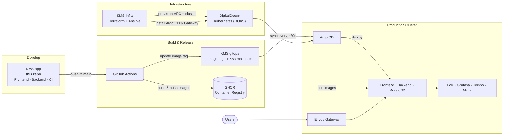

# Kitchen Management System (KMS)

A cloud-native kitchen management platform — Angular frontend, Node.js API, and MongoDB — deployed to Kubernetes on DigitalOcean using GitOps.

## Architecture

```mermaid
flowchart LR
    subgraph dev["Develop"]
        CODE["KMS-app<br/><b>this repo</b><br/>Frontend · Backend · CI"]
    end

    subgraph build["Build & Release"]
        GHA["GitHub Actions"]
        GHCR[("GHCR<br/>Container Registry")]
        GITOPS["KMS-gitops<br/>Image tags + K8s manifests"]
    end

    subgraph infra["Infrastructure"]
        TF["KMS-infra<br/>Terraform + Ansible"]
        DOKS["DigitalOcean<br/>Kubernetes (DOKS)"]
    end

    subgraph run["Production Cluster"]
        ARGO["Argo CD"]
        APP["Frontend · Backend · MongoDB"]
        GW["Envoy Gateway"]
        OBS["Loki · Grafana · Tempo · Mimir"]
    end

    CODE -->|push to main| GHA
    GHA -->|build & push images| GHCR
    GHA -->|update image tag| GITOPS
    TF -->|provision VPC + cluster| DOKS
    TF -->|install Argo CD & Gateway| DOKS
    GITOPS -->|sync every ~30s| ARGO
    ARGO -->|deploy| APP
    GHCR -->|pull images| APP
    DOKS --> ARGO
    USERS(["Users"]) --> GW --> APP
    APP --> OBS
```

## Three Repositories

| Repository | Role |
|------------|------|
| **KMS-app** (here) | Application source code, Dockerfiles, GitHub Actions CI |
| **KMS-gitops** | Kubernetes manifests, Kustomize, Argo CD applications |
| **KMS-infra** | Terraform (VPC, DOKS) + Ansible (cluster bootstrap) |

## Deployment Flow

1. Developer pushes code → GitHub Actions builds Docker images → pushes to GHCR  
2. CI updates the image tag in **KMS-gitops** → Argo CD detects the change → rolls out new pods on DOKS  
3. **KMS-infra** is run once (or on infra changes) to create the cluster and platform tooling  
