# Kitchen Management System (KMS) - Complete ERD

```mermaid
erDiagram
    %% User Management
    User {
        ObjectId _id PK
        String firstName
        String lastName
        String email UK
        String password
        String role
        String profileImage
        Boolean isActive
        String status
        String kitchenNo
        Date createdAt
    }

    Attendance {
        ObjectId _id PK
        ObjectId user FK
        Date date
        Boolean isPresent
        Date createdAt
        Date updatedAt
    }

    %% Newsletter
    Newsletter {
        ObjectId _id PK
        String email UK
        Boolean isSubscribed
        Date createdAt
    }

    %% Meals & Categories
    Category {
        ObjectId _id PK
        String name
        String description
        Date createdAt
    }

    Meal {
        ObjectId _id PK
        String title
        String description
        Number servings
        Number price
        ObjectId category FK
        Array images
        Boolean isActive
        ObjectId nutritionalInfo FK
        ObjectId dietaryInfo FK
        Date createdAt
        Date updatedAt
    }

    %% Nutritional & Dietary Information
    NutritionalInfo {
        ObjectId _id PK
        Number calories
        Number protein
        Number carbohydrates
        Number fat
        Number fiber
        Number sugar
        Number sodium
        Date createdAt
        Date updatedAt
    }

    DietaryInfo {
        ObjectId _id PK
        Boolean isVegetarian
        Boolean isVegan
        Boolean isGlutenFree
        Boolean isDairyFree
        Boolean isNutFree
        Boolean isHalal
        Boolean isKosher
        Date createdAt
        Date updatedAt
    }

    %% Allergens
    Allergen {
        ObjectId _id PK
        String name
        String description
        Date createdAt
    }

    MealAllergen {
        ObjectId _id PK
        ObjectId mealId FK
        ObjectId allergenId FK
        Date createdAt
    }

    %% Ingredients & Stock Management
    Ingredient {
        ObjectId _id PK
        String name UK
        String description
        String category
        Number stock
        String unit
        Number reorderLevel
        Number costPerUnit
        Boolean isActive
        Date createdAt
        Date updatedAt
    }

    IngredientBatch {
        ObjectId _id PK
        ObjectId ingredientId FK
        Number quantity
        Date expiryDate
        Date receivedDate
        String batchNumber
        Date createdAt
        Date updatedAt
    }

    MealIngredient {
        ObjectId _id PK
        ObjectId mealId FK
        ObjectId ingredientId FK
        Number quantity
        String unit
        Date createdAt
    }

    %% Tags
    Tag {
        ObjectId _id PK
        String name
        String description
        Date createdAt
    }

    MealTag {
        ObjectId _id PK
        ObjectId mealId FK
        ObjectId tagId FK
        Date createdAt
    }

    %% Meal Planning
    MealPlan {
        ObjectId _id PK
        Date date
        Array meals
        String type
        ObjectId createdBy FK
        Array assignedStaff
        String notes
        Date createdAt
        Date updatedAt
    }

    %% Orders
    Order {
        ObjectId _id PK
        ObjectId userId FK
        Array items
        Number totalAmount
        String status
        String paymentStatus
        Date createdAt
        Date updatedAt
    }

    %% Notifications
    Notification {
        ObjectId _id PK
        ObjectId userId FK
        String title
        String message
        String type
        Boolean isRead
        Date createdAt
        Date updatedAt
    }

    %% Relationships
    User ||--o{ Attendance : "has"
    User ||--o{ Order : "places"
    User ||--o{ Notification : "receives"
    User ||--o{ MealPlan : "creates"
    User ||--o{ MealPlan : "assigned_to"

    Category ||--o{ Meal : "categorizes"
    Meal ||--o{ MealAllergen : "has"
    Allergen ||--o{ MealAllergen : "belongs_to"
    Meal ||--o{ MealIngredient : "contains"
    Ingredient ||--o{ MealIngredient : "used_in"
    Meal ||--o{ MealTag : "tagged_with"
    Tag ||--o{ MealTag : "applied_to"

    Meal ||--o{ MealPlan : "planned_in"
    Meal ||--o{ Order : "ordered_in"

    Ingredient ||--o{ IngredientBatch : "has_batches"

    Meal ||--|| NutritionalInfo : "has"
    Meal ||--|| DietaryInfo : "has"
```

## Entity Descriptions

### 🧑‍💼 User Management
- **User**: Core user entity with authentication and role-based access
- **Attendance**: Tracks staff attendance for meal planning and resource management

### 📧 Newsletter
- **Newsletter**: Email subscription management for marketing

### 🍽️ Meals & Categories
- **Category**: Meal categorization (e.g., Breakfast, Lunch, Dinner)
- **Meal**: Core meal entity with basic information and references to normalized data

### 🥗 Nutritional & Dietary Information
- **NutritionalInfo**: Detailed nutritional breakdown (calories, protein, etc.)
- **DietaryInfo**: Dietary restrictions and preferences (vegetarian, gluten-free, etc.)

### 🚨 Allergens
- **Allergen**: Allergen definitions (nuts, dairy, etc.)
- **MealAllergen**: Many-to-many relationship between meals and allergens

### 🥬 Ingredients & Stock Management
- **Ingredient**: Ingredient definitions with stock management
- **IngredientBatch**: Batch tracking with expiry dates for inventory management
- **MealIngredient**: Many-to-many relationship between meals and ingredients with quantities

### 🏷️ Tags
- **Tag**: Flexible tagging system for meals (e.g., "Spicy", "Chef's Special")
- **MealTag**: Many-to-many relationship between meals and tags

### 📅 Meal Planning
- **MealPlan**: Daily/weekly meal planning with staff assignments

### 🛒 Orders
- **Order**: Customer order management with payment tracking

### 🔔 Notifications
- **Notification**: User notification system for alerts and updates

## Key Features

### 🔄 Normalized Schema
- All complex data is normalized into separate collections
- Proper relationships maintained through ObjectId references
- Junction tables for many-to-many relationships

### 📊 Advanced Stock Management
- Batch-based inventory with expiry tracking
- Automatic stock calculation from non-expired batches
- Low stock alerts and reorder level management

### 👥 Staff Management
- Role-based access control (admin, chef, user)
- Attendance tracking for resource planning
- Staff assignment to meal plans

### 🏷️ Flexible Tagging
- Dynamic meal categorization without hardcoding
- Easy filtering and search capabilities
- Scalable tagging system

### 📈 Meal Planning
- Daily and weekly meal planning
- Resource checking (staff and ingredients)
- Stock sufficiency validation
